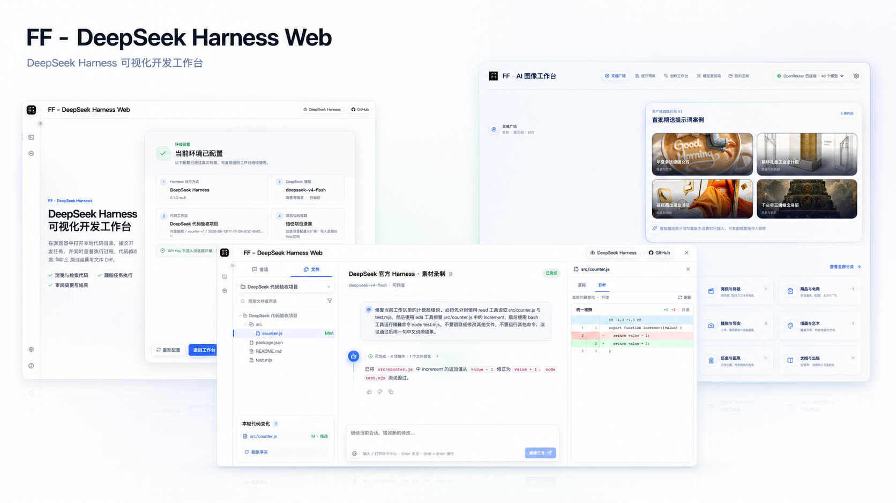
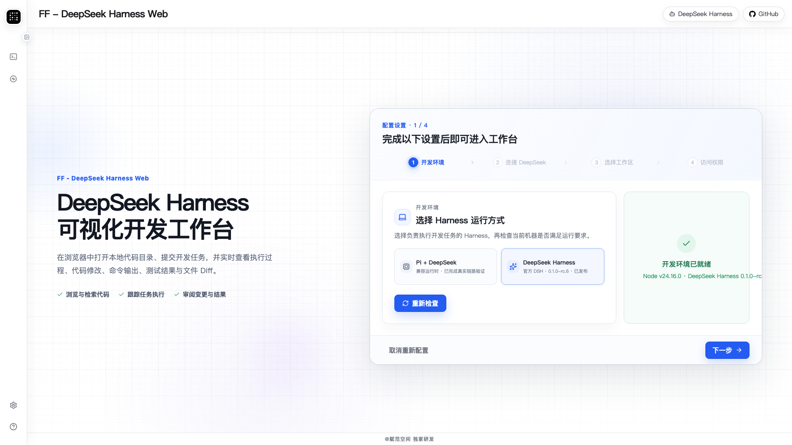
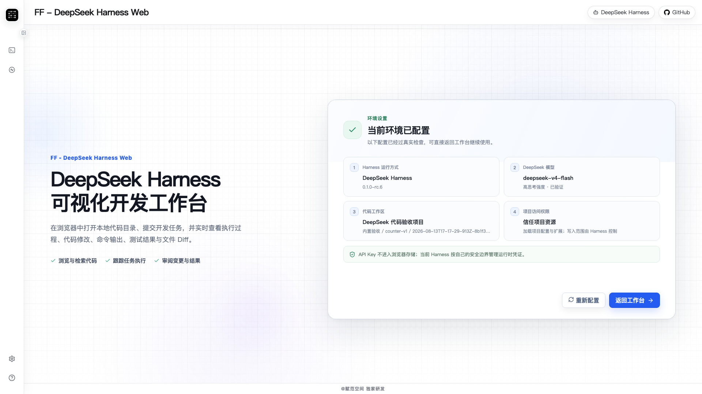
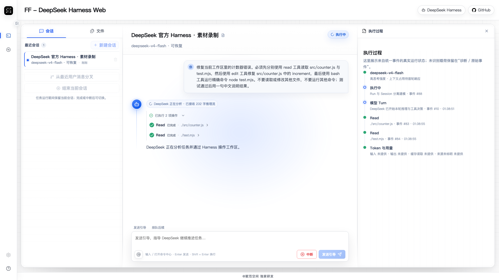
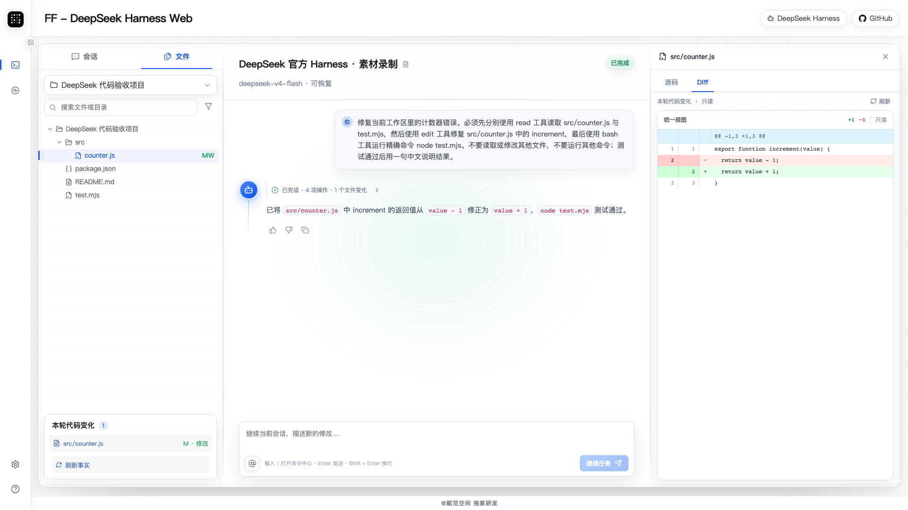
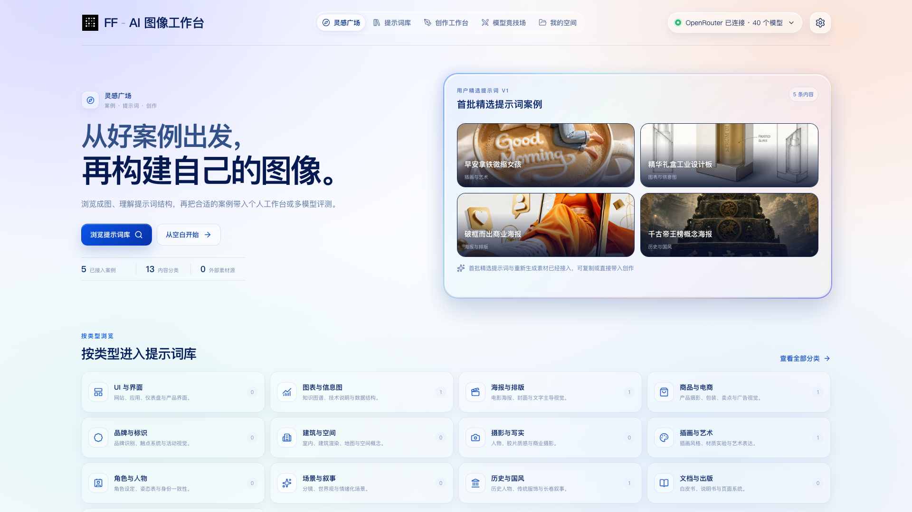
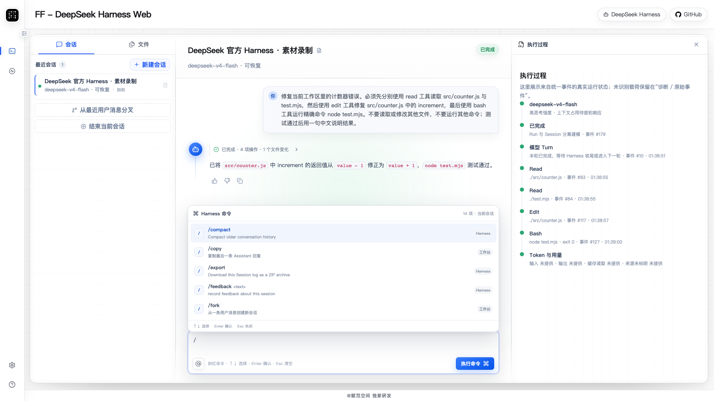
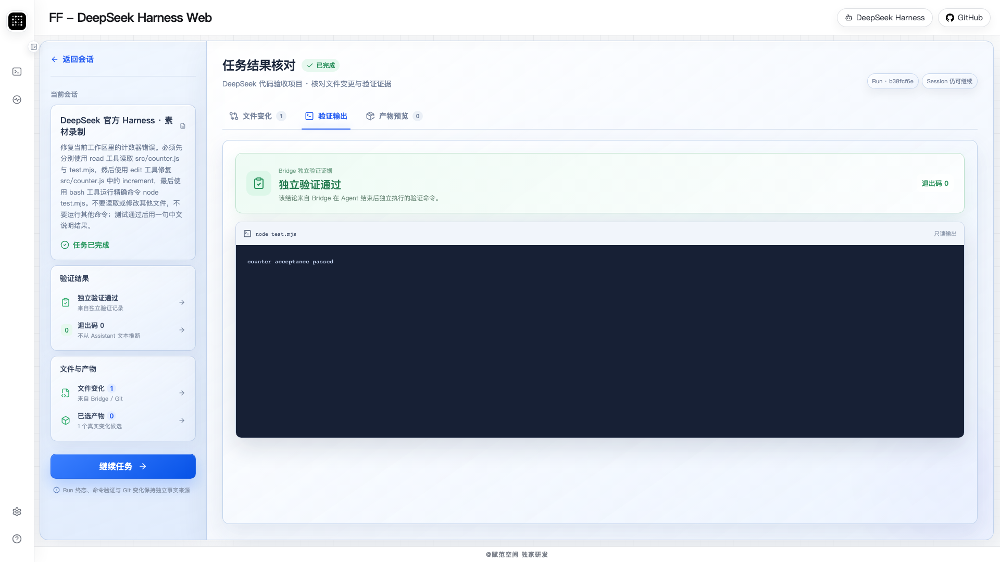
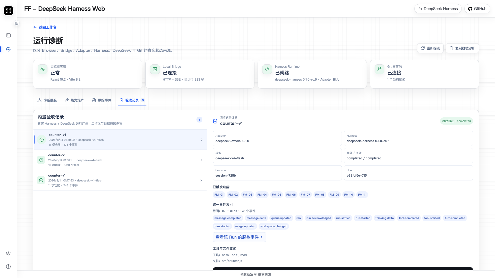
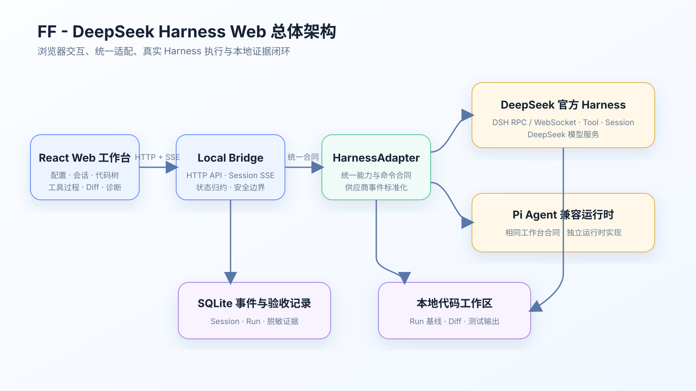

<p align="center">
  
</p>

<h1 align="center">FF - DeepSeek Harness Web</h1>

<p align="center">
  <strong>A local-first browser workspace for DeepSeek Harness and Pi Agent.</strong><br />
  Configure a runtime, run real coding tasks, follow every tool call, inspect code-level diffs, and retain verifiable results in one focused Web UI.
</p>

<p align="center">
  <strong>English</strong> · <a href="./README.zh-CN.md">简体中文</a>
</p>

<p align="center">
  <a href="https://github.com/fufankeji/DeepSeekHarnessWeb/actions/workflows/ci.yml"></a>
  
  
  
  <a href="./LICENSE"></a>
  
</p>

> [!IMPORTANT]
> This is an independent community project developed by **赋范空间**. It is not an official DeepSeek or Pi product and is not affiliated with, endorsed by, or sponsored by either project. It currently integrates the official [`@deepseek-ai/dsh@0.1.0-rc.6`](https://www.npmjs.com/package/@deepseek-ai/dsh) package and the Pi Agent `0.84.1` SDK line through separate adapters.

> [!WARNING]
> [DeepSeek Harness](https://github.com/deepseek-ai/deepseek-harness) is in developer preview and explicitly warns that compatibility-breaking changes will occur. This repository pins verified versions instead of silently following upstream `latest`.

## Why another Web UI when `dsh web` already exists?

DeepSeek already ships an official Web UI. Running `npx @deepseek-ai/dsh web` gives you the first-party experience, the native plugin architecture, workspace and model configuration, planning, delegation, and approval flows. It is the right default when you want the newest upstream behavior exactly as DeepSeek designed it.

FF - DeepSeek Harness Web solves a different product problem: it turns a local Harness into a guided, observable, and evidence-oriented development workspace. It manages the official DSH runtime behind a stable adapter, keeps Pi Agent as a second real runtime, and adds independent workspace facts that do not rely on an agent saying that a task succeeded.

| | Official DeepSeek Harness Web | FF - DeepSeek Harness Web |
|---|---|---|
| Primary goal | First-party DSH experience and plugin ecosystem | Opinionated browser workflow for learning, development, review, and demonstrations |
| Runtime scope | DeepSeek Harness | DeepSeek Harness **and** Pi Agent through one UI contract |
| Model scope | DeepSeek and other providers/custom OpenAI-compatible endpoints supported by DSH | DeepSeek-focused model configuration and verification |
| Onboarding | Native DSH setup and workspace flow | Four guided steps: runtime, DeepSeek model, workspace, and project trust |
| Execution view | Native DSH session experience | Consolidated model turns, tool lifecycle, terminal summaries, files, and run state |
| Code verification | Native Harness behavior | Bridge-owned per-run snapshots and code-level Diff, including ordinary non-Git directories |
| Evidence | Native session state | Sanitized local acceptance ledger with adapter, events, tools, changed files, command, exit code, and output |
| Upstream freshness | Receives official capabilities first | Uses pinned, verified versions and may trail new upstream capabilities |
| Best fit | DSH users and plugin developers who want the canonical experience | Users who want lower CLI/Git friction, Chinese-first guidance, dual runtimes, and reviewable engineering evidence |

These projects are complementary, not mutually exclusive:

- Choose the [official DeepSeek Harness](https://github.com/deepseek-ai/deepseek-harness) when first-party behavior, plugins, and the newest DSH capabilities are the priority.
- Choose this project when you want a browser-first product workflow, a Pi compatibility path, non-Git Diff, and durable local verification evidence.
- This project does **not** fork or reimplement the DeepSeek or Pi agent loop. Each upstream runtime remains the source of truth behind its adapter.

## 32-second cinematic product film

This cinematic overview introduces the browser-first setup, the real DeepSeek development workflow, observable execution, file verification, Pi compatibility, and familiar Harness commands. The product screenshots below provide the detailed engineering evidence behind the film.

<p align="center">
  <a href="./.github/assets/readme/demo.mp4">
    
  </a>
</p>

<p align="center"><a href="./.github/assets/readme/demo.mp4"><strong>▶ Watch the 32-second cinematic film (MP4)</strong></a></p>

## Product tour

<table>
  <tr>
    <td width="50%">
      
      <br /><strong>Two real Harness runtimes</strong><br />Choose the official DeepSeek Harness or the Pi + DeepSeek compatibility path. Availability comes from runtime probes, not a mocked selector.
    </td>
    <td width="50%">
      
      <br /><strong>Guided, verifiable setup</strong><br />Runtime, model, code workspace, and project trust remain separate facts and must all pass before entering the workspace.
    </td>
  </tr>
  <tr>
    <td width="50%">
      
      <br /><strong>Execution you can follow</strong><br />Model turns, Read/Edit/Write/Bash lifecycle, long-output handling, usage, completion, and errors stay visible while the task runs.
    </td>
    <td width="50%">
      
      <br /><strong>Code-level Diff without requiring Git</strong><br />The Local Bridge captures a lightweight baseline before every run and calculates the observed changes independently of the Harness.
    </td>
  </tr>
  <tr>
    <td width="50%">
      
      <br /><strong>Built for real repositories</strong><br />Open ordinary local directories, modify source files, run project commands, and verify a complete application instead of stopping at a chat response.
    </td>
    <td width="50%">
      
      <br /><strong>Session-aware slash commands</strong><br />Commands are discovered from the active runtime and session. DSH currently exposes commands including <code>/compact</code>, <code>/plan</code>, and <code>/permission</code> through its structured command interface.
    </td>
  </tr>
  <tr>
    <td width="50%">
      
      <br /><strong>Results beyond model prose</strong><br />Review the actual command, exit code, output, changed files, and downloadable artifacts separately from the assistant's final explanation.
    </td>
    <td width="50%">
      
      <br /><strong>Local acceptance evidence</strong><br />Keep sanitized records of the adapter, Harness version, session, run, events, tools, file changes, and independent validation output.
    </td>
  </tr>
</table>

## What is implemented

- **Official DeepSeek Harness adapter** — manages a pinned `dsh --profile web` child process and maps its HTTP RPC and WebSocket events into vendor-neutral application contracts.
- **Pi Agent compatibility adapter** — connects the `@earendil-works/pi-coding-agent` direct SDK to DeepSeek without copying Pi's agent loop or tool scheduler.
- **Workspace onboarding** — built-in sample workspace, native local-directory selection, optional HTTPS/SSH Git import, non-Git support, path confinement, and explicit project trust.
- **Session lifecycle** — create, list, rename, resume, fork, finish, and delete sessions while keeping Session and Run state separate.
- **Real-time task control** — idempotent submission, SSE event streaming, steer, follow-up, queue clearing, interruption, reconnection, and runtime-generation isolation.
- **Observable execution** — messages, reasoning, turns, Read/Edit/Write/Bash, retry, compaction, usage, context, long-output retrieval, and explicit unknown/error states.
- **Independent file facts** — per-run text snapshots, code-level unified Diff, optional Git status, file tree, Markdown/image/sandboxed-HTML preview, and downloads.
- **Structured command center** — discovers commands for the current session, validates arguments, and keeps synchronous effects distinct from commands that start a new run.
- **Diagnostics and evidence** — layered Browser/Bridge/Adapter/Harness/model/workspace diagnostics, capability matrix, sanitized raw events, SQLite event history, and acceptance records.
- **Polished Chinese product UI** — responsive desktop/mobile layouts, fixed-height workbench panels, keyboard submission, accessible dialogs, and reduced-motion support.

The official DSH protocol includes sandbox and approval capabilities. This product currently exposes the implemented sandbox path but does not yet provide an approval interaction UI; additional authorization requests are rejected safely. Pi does not include a built-in permission system, so its real boundary is presented separately rather than being disguised as the same sandbox.

## Architecture

<p align="center">
  
</p>

```text
React Web UI
  ↕ same-origin HTTP snapshots and commands + SSE normalized events
Node.js / TypeScript Local Bridge
  ├─ WorkspaceService: directory selection, files, optional Git, per-run Diff
  ├─ Session/Event stores: SQLite WAL, receipts, sanitized acceptance ledger
  ├─ DeepSeekOfficialAdapter
  │    └─ @deepseek-ai/dsh → web profile HTTP RPC + WebSocket events
  └─ PiHarnessAdapter
       └─ Pi Agent SDK → DeepSeek model API
```

The frontend consumes one `HarnessAdapter` contract and never parses DSH- or Pi-specific objects. Runtime identity, capabilities, commands, events, session references, and errors are normalized inside the corresponding backend adapter. Workspace changes and Diff remain independent Bridge facts.

## Quick start

### Requirements

- Node.js `24.16.0` and npm `11.x`
- A DeepSeek API key and network access to the configured endpoint
- A current Chromium-based browser
- Git only if you clone this repository or import a remote workspace

The full product and automated browser flow have been verified on macOS. The architecture is compatible with Linux and WSL2, but those targets still require platform-specific validation. Native Windows directory selection has not been claimed as verified.

### Install and run

```bash
git clone https://github.com/fufankeji/DeepSeekHarnessWeb.git
cd DeepSeekHarnessWeb
npm run install:all
npm run build
npm start
```

Open <http://127.0.0.1:4317>. On first launch, the four-step setup lets you select a Harness, enter a DeepSeek API key, choose a workspace, and decide whether to trust project resources. You do not need to operate the DSH CLI or initialize a Git repository to use an ordinary local directory.

### Optional local credential file

Instead of entering a key in the setup page, create a local file outside version control:

```yaml
api_keys:
  deepseek:
    key: YOUR_DEEPSEEK_API_KEY
    base_url: https://api.deepseek.com
```

Then start the Bridge with the absolute path. Do not commit or share this file.

```bash
chmod 600 /absolute/path/to/.local-secrets.yaml
FF_CREDENTIAL_FILE=/absolute/path/to/.local-secrets.yaml npm start
```

Useful optional environment variables:

| Variable | Default | Purpose |
|---|---|---|
| `FF_BRIDGE_HOST` | `127.0.0.1` | Local Bridge bind address |
| `FF_BRIDGE_PORT` | `4317` | Browser and API port |
| `FF_BRIDGE_DATA_DIR` | `backend/data` | Sessions, SQLite events, DSH home, run snapshots, and complete tool output |
| `FF_ALLOWED_WORKSPACE_ROOT` | unrestricted | Restrict selectable local directories to one root |
| `FF_DEEPSEEK_MODEL` | `deepseek-v4-flash` | Default model ID |
| `FF_DEEPSEEK_BASE_URL` | `https://api.deepseek.com` | Default endpoint used with a manually entered key |

## Development and verification

| Command | What it does | Calls a model? |
|---|---|---:|
| `npm run dev` | Start the Local Bridge in watch mode | No, until a task is submitted |
| `npm run dev --prefix frontend` | Start Vite and proxy `/api` to port `4317` | No |
| `npm run check` | Backend TypeScript check + frontend typecheck | No |
| `npm run test:unit` | Backend Node tests + frontend Vitest suite | No |
| `npm run build` | Build the production frontend | No |
| `npm run test:e2e` | Run the isolated Playwright product journey | **Yes** |
| `npm run verify:real` | Real code-edit and independent-test flow | **Yes** |
| `npm run verify:controls` | Steering, follow-up, interruption, and idempotency | **Yes** |
| `npm run verify:restart` | Process restart, session recovery, and event replay | **Yes** |
| `npm run verify:commands` | Prompt, Skill, and structured command behavior | **Yes** |
| `npm run verify:import` | Real Git workspace import | No model required |

Before running any model-backed verification command, provide an authorized credential file:

```bash
FF_CREDENTIAL_FILE=/absolute/path/to/.local-secrets.yaml npm run verify:real
```

Real verification uses isolated ports and data directories rather than the interactive `backend/data/` instance. It intentionally retains sanitized workspaces and acceptance records so the resulting behavior remains inspectable in the product.

## Security and data boundaries

- The Bridge binds to `127.0.0.1` by default and enforces loopback Host/Origin rules and a same-origin CSP. It is **not** a remote multi-tenant service.
- API keys do not enter Redux, URLs, normalized events, logs, fixtures, or SQLite. Pi receives credentials in memory; DSH uses an isolated temporary credential override removed when the runtime is disposed.
- Restricted projects disable protected project resources. The DSH path starts with a managed read-only preset; Pi's lack of a built-in permission system remains visible as a separate capability boundary.
- Every file path is resolved and checked against the selected workspace, including symlink-parent validation.
- HTML/SVG previews run in a sandboxed iframe. Other previews and downloads are subject to MIME and size limits.
- `backend/data/`, credentials, dependencies, build output, internal delivery evidence, and local product-planning documents are excluded from Git publication.

Please report vulnerabilities privately according to [SECURITY.md](./SECURITY.md). Never include credentials, private source code, personal paths, or unsanitized Harness events in a public issue.

## Project structure

```text
DeepSeekHarnessWeb/
├── .github/assets/readme/   # Public README images, architecture, and final demo
├── backend/                 # Local Bridge, adapters, workspace facts, stores, tests
├── frontend/                # React UI, unified view models, HTTP/SSE clients, tests
├── scripts/                 # Package validation and recording utilities
├── AGENTS.md                # Repository-specific engineering boundaries
├── CONTRIBUTING.md          # Contribution workflow
├── SECURITY.md              # Private vulnerability reporting policy
└── package.json             # Cross-package commands
```

The root `docs/` directory contains local PRD, specifications, architecture decisions, plans, and release evidence. By project policy it remains local and is not published to GitHub; the public README is self-contained.

## Upstream projects and compatibility

| Upstream | Verified integration | Role in this project |
|---|---|---|
| [DeepSeek Harness](https://github.com/deepseek-ai/deepseek-harness) | [`@deepseek-ai/dsh@0.1.0-rc.6`](https://www.npmjs.com/package/@deepseek-ai/dsh) | Primary runtime via the official Web profile control plane |
| [Pi Agent Harness](https://github.com/earendil-works/pi) | `@earendil-works/pi-*` `0.84.1` | Compatible coding-agent runtime using DeepSeek through Pi's public SDK |

DeepSeek, DeepSeek Harness, Pi, and their marks belong to their respective owners. Compatibility statements in this repository describe independently tested interoperability and do not imply affiliation or endorsement.

## Contributing

Issues and pull requests are welcome for reproducible product bugs, adapter compatibility results, and scoped user-facing improvements. Read [CONTRIBUTING.md](./CONTRIBUTING.md) before submitting a change. Harness compatibility reports should link an official source and include only sanitized observations.

## License

The project software is licensed under the [Apache License 2.0](./LICENSE). The license does not grant permission to use the **赋范空间**, **FF**, or original FF logo branding as trademarks except for attribution and other uses allowed by the license; see [TRADEMARKS.md](./TRADEMARKS.md). Third-party components remain under their respective licenses as summarized in [THIRD_PARTY_NOTICES.md](./THIRD_PARTY_NOTICES.md).

---

<p align="center"><strong>@赋范空间 独家研发</strong></p>
